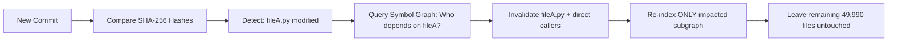

# Greppa: Complete System Architecture & Engineering Guide 🎓📖

Welcome to **Greppa**! This guide is written to teach you exactly how modern large-scale code intelligence engines work under the hood.

Whether you are building your own AI developer tools, studying advanced RAG (Retrieval-Augmented Generation), or seeking to understand AST parsers, symbol graphs, and agent reasoning loops, this document explains every concept from first principles.

---

## Table of Contents
1. [The Golden Rule: Why Naive RAG Fails for Code](#1-the-golden-rule-why-naive-rag-fails-for-code)
2. [End-to-End System Map](#2-end-to-end-system-map)
3. [Deep Dive: Ingestion Pipeline](#3-deep-dive-ingestion-pipeline)
   - [File Filtering & SHA-256 Hashing](#31-file-filtering--content-hashing)
   - [Tree-sitter AST Symbol Parsing](#32-tree-sitter-ast-symbol-parsing)
   - [Symbol Graph Construction](#33-symbol-graph-construction)
   - [PageRank Importance Scoring](#34-pagerank-importance-scoring)
   - [Symbol-Aware AST Chunking](#35-symbol-aware-ast-chunking)
   - [Bottom-Up Hierarchical Summarization](#36-bottom-up-hierarchical-summarization)
4. [Deep Dive: Query & Agent Pipeline](#4-deep-dive-query--agent-pipeline)
   - [Hybrid Search: Vector + Keyword](#41-hybrid-search-dense--sparse)
   - [Reciprocal Rank Fusion (RRF)](#42-reciprocal-rank-fusion-rrf--pagerank)
   - [Graph Context Expansion](#43-graph-context-expansion)
   - [Token Budget Packing](#44-token-budget-packing)
   - [The Multi-Step Agent Reasoning Loop](#45-the-multi-step-agent-reasoning-loop)
5. [Deep Dive: Incremental Invalidation Engine](#5-deep-dive-incremental-invalidation-engine)
6. [Interactive Code Walkthrough & Mental Map](#6-codebase-mental-map)
7. [Hands-On Experiments to Try](#7-hands-on-experiments-to-try)

---

## 1. The Golden Rule: Why Naive RAG Fails for Code

> **"Never feed the whole codebase to a model. Build an index once, then retrieve only what each question needs."**

Most developers who build document search start by slicing text every 500 characters or 50 lines. **This completely fails on source code.**

### The Three Deadly Flaws of Naive Code Search:
1. **The Slice-in-Half Problem**: Slicing by line count splits functions across chunk boundaries. The LLM gets a function's parameters in Chunk A and its return statement in Chunk B, losing the mental model of the routine.
2. **Context Blindness**: Code is deeply interconnected. A function `validate_token()` has no meaning in isolation without knowing **who calls it** (e.g. `UserController.login()`) or **what it calls** (e.g. `crypto.verify_hmac()`).
3. **The "Lost in the Middle" Attention Trap**: Squeezing an entire 100,000-line repository into a 1M-token context window causes severe attention degradation, massive latency (30–60s per answer), and high cost.

**Greppa solves this by turning code into a structured, searchable knowledge graph.**

---

## 2. End-to-End System Map

```mermaid
flowchart TD
    subgraph Ingestion ["Ingestion Pipeline (Offline / Background)"]
        A["Repository Files"] --> B["Scanner & SHA-256 Hasher"]
        B --> C["Tree-Sitter AST Parser"]
        C --> D["Symbol Graph Builder (Defines, Calls, Imports)"]
        D --> E["PageRank Importance Calculator"]
        C --> F["Symbol Chunker (Functions, Classes, Methods)"]
        F --> G["Bottom-Up Summarizer (Func ➔ File ➔ Folder ➔ Repo)"]
        G & F --> H[("Postgres + pgvector & tsvector")]
    end

    subgraph Query ["Query & Agent Pipeline (Online / User Request)"]
        Q["User Question"] --> HS["Hybrid Search (Vector + Keyword)"]
        HS --> RRF["RRF Re-ranking + PageRank Prior"]
        RRF --> GE["Graph Expander (Callers, Callees, Parent Class)"]
        GE --> TBP["Token Budget Context Packer"]
        TBP --> AG["Multi-Step Agent Loop"]
        AG --> ANS["Synthesized Answer + File & Line Citations"]
    end
```



---

## 3. Deep Dive: Ingestion Pipeline

### 3.1 File Filtering & Content Hashing
Before touching a single parser, Greppa ignores irrelevant noise:
- Respects `.gitignore` rules via git pattern matching.
- Hard-skips `node_modules`, `.venv`, `.git`, build outputs (`dist/`, `build/`, `.next/`), lockfiles (`package-lock.json`, `poetry.lock`), binaries, and files $> 1\text{ MB}$.
- Computes a **SHA-256 cryptographic hash** of every file's byte contents. This hash is the foundation of incremental updates.

*File reference:* [`backend/app/ingestion/scanner.py`](file:///c:/Users/DR4KEN/Documents/Greppa/backend/app/ingestion/scanner.py)

---

### 3.2 Tree-sitter AST Symbol Parsing
Instead of treating code as plain text strings, Greppa parses source files into an **Abstract Syntax Tree (AST)** using Tree-sitter.

An AST turns this Python snippet:
```python
class AuthService:
    def authenticate_user(self, username: str, password_hash: str) -> bool:
        """Validates credentials."""
        return self._verify_hash(username, password_hash)
```

Into structured AST nodes:
```
class_definition [name: AuthService]
  └── body
      └── function_definition [name: authenticate_user]
            ├── parameters: (self, username, password_hash)
            ├── return_type: bool
            ├── docstring: "Validates credentials."
            └── body
                  └── call_expression: _verify_hash
```

From this AST, Greppa extracts:
- Exact symbol name (`AuthService.authenticate_user`)
- Kind (`class`, `function`, `method`, `interface`)
- Precise line bounds (`start_line: 2`, `end_line: 5`)
- Full signature (`def AuthService.authenticate_user(...) -> bool`)
- Extracted calls: `["_verify_hash"]`

*File reference:* [`backend/app/ingestion/parser.py`](file:///c:/Users/DR4KEN/Documents/Greppa/backend/app/ingestion/parser.py)

---

### 3.3 Symbol Graph Construction
Once all files are parsed into symbols, Greppa builds a directed graph $G = (V, E)$ using `NetworkX`:
- **Nodes ($V$)**:
  - `file:auth_service.py`
  - `sym:auth_service.py:AuthService`
  - `sym:auth_service.py:AuthService.authenticate_user`
- **Edges ($E$)**:
  - `DEFINES`: `file:auth_service.py` $\rightarrow$ `sym:auth_service.py:AuthService`
  - `IMPORTS`: `file:user_controller.py` $\rightarrow$ `file:auth_service.py`
  - `CALLS`: `sym:user_controller.py:handle_login` $\rightarrow$ `sym:auth_service.py:AuthService.authenticate_user`

*File reference:* [`backend/app/ingestion/graph_builder.py`](file:///c:/Users/DR4KEN/Documents/Greppa/backend/app/ingestion/graph_builder.py)

---

### 3.4 PageRank Importance Scoring
In a codebase with 1,000 files, how does the system know which files are core architecture vs. minor utilities?

Greppa computes **PageRank** on the directed symbol graph:

$$PR(u) = \frac{1 - d}{|V|} + d \sum_{v \in \mathcal{B}_u} \frac{PR(v)}{L(v)}$$

Where:
- $d = 0.85$ is the damping factor.
- $\mathcal{B}_u$ are all nodes that import or call node $u$.
- $L(v)$ is the number of outgoing links from node $v$.

**Intuition**:
- If `AuthService` is called by 10 different controllers, its PageRank score increases significantly.
- If a helper function is only called once by a test script, its PageRank score remains low.
- Greppa normalizes these scores around a baseline of `1.0`. Highly central files score `2.5–5.0+`.

---

### 3.5 Symbol-Aware AST Chunking
Every chunk stored in the database corresponds to an AST symbol:
```python
SymbolChunk(
    file_path="auth_service.py",
    symbol_name="AuthService.authenticate_user",
    kind="method",
    parent_class="AuthService",
    signature="def AuthService.authenticate_user(self, username, password_hash) -> bool",
    start_line=2,
    end_line=5,
    content="...",
    importance_score=2.84
)
```
No function is ever chopped in half.

*File reference:* [`backend/app/ingestion/chunker.py`](file:///c:/Users/DR4KEN/Documents/Greppa/backend/app/ingestion/chunker.py)

---

### 3.6 Bottom-Up Hierarchical Summarization
Large codebases cannot be summarized top-down because the root doesn't know the implementation details. Greppa summarizes **strictly bottom-up**:

```
Level 4: Repository Tour Summary (Synthesized from Folder Summaries)
   ▲
Level 3: Folder Summaries (Synthesized from File Summaries)
   ▲
Level 2: File Summaries (Synthesized from Symbol Summaries + Docstring)
   ▲
Level 1: Function / Method Summaries (Synthesized from Code & Docstring)
```

**Why this matters**:
1. **Accuracy**: Each level only summarizes compact inputs from the level below it.
2. **Infinite Caching**: If you edit one function in `auth_service.py`, only that function and file are re-summarized. The other 999 files are read directly from cache.

*File reference:* [`backend/app/ingestion/summarizer.py`](file:///c:/Users/DR4KEN/Documents/Greppa/backend/app/ingestion/summarizer.py)

---

## 4. Deep Dive: Query & Agent Pipeline

### 4.1 Hybrid Search (Dense + Sparse)
When a user asks: `"How does authentication work?"`, Greppa performs two searches in parallel:

1. **Dense Vector Search**:
   - Computes embedding using `text-embedding-004` (768 dimensions).
   - Computes cosine similarity against all chunk embeddings.
   - *Strengths*: Captures semantic concepts (e.g. maps "login" to "authenticate").
2. **Sparse Keyword Search**:
   - Searches exact symbol identifiers and function signatures.
   - *Strengths*: Directly locates exact method names (e.g. `verify_jwt_token`).

*File reference:* [`backend/app/search/hybrid.py`](file:///c:/Users/DR4KEN/Documents/Greppa/backend/app/search/hybrid.py)

---

### 4.2 Reciprocal Rank Fusion (RRF) + PageRank
Greppa fuses the vector rank and keyword rank using **Reciprocal Rank Fusion**:

$$RRF(d) = \frac{w_{vec}}{k + \text{rank}_{vec}(d)} + \frac{w_{kw}}{k + \text{rank}_{kw}(d)}$$

Where $k = 60$.

Then, Greppa applies the **PageRank multiplier**:

$$\text{FinalScore}(d) = RRF(d) \times \left(1.0 + \alpha \times (\text{Importance}(d) - 1.0)\right)$$

This ensures that central architectural components win tie-breakers over obscure test mocks.

---

### 4.3 Graph Context Expansion
Retrieving the top hit `authenticate_user()` is not enough. The LLM needs the architectural context.

Greppa's Graph Expander queries `SymbolEdgeRecord` to fetch:
- **Callers**: Who calls this function? (e.g., `UserController.handle_login`)
- **Callees**: What does this function call? (e.g., `_verify_hash`)
- **Parent Class**: What class does this belong to? (e.g., `class AuthService`)

*File reference:* [`backend/app/search/expander.py`](file:///c:/Users/DR4KEN/Documents/Greppa/backend/app/search/expander.py)

---

### 4.4 Token Budget Packing
Prompts must not overflow the model's budget. The Context Packer prioritizes:
1. **Priority 1**: The exact source code of top symbol hits.
2. **Priority 2**: Signatures and locations of callers & callees.
3. **Priority 3**: Parent class docstring and header.
4. **Priority 4**: File overview.

As chunks are packed, the packer computes token counts. When the budget (e.g., 8,000 tokens) is reached, it closes the prompt and attaches exact citation ranges (`[File: auth_service.py:2-5]`).

*File reference:* [`backend/app/search/packer.py`](file:///c:/Users/DR4KEN/Documents/Greppa/backend/app/search/packer.py)

---

### 4.5 The Multi-Step Agent Reasoning Loop
For deep questions like: *"Walk me through the user registration and validation flow end to end."*, a single retrieval step is insufficient.

Greppa uses a **ReAct Agent Loop**:

```
Step 1: Thought: "Search for registration endpoints and validation."
        Action: hybrid_search("user registration validation")
        Observation: Found `UserController.register()` and `UserValidator`.

Step 2: Thought: "Expand call hierarchy around `UserController.register` to see where it saves to DB."
        Action: follow_call_hierarchy("UserController.register")
        Observation: Called by router; calls `UserRepository.create_user()`.

Step 3: Thought: "Inspect `UserRepository.create_user` implementation."
        Action: read_symbol("UserRepository.create_user")
        Observation: Encrypts password and executes INSERT query.

Step 4: Synthesize Final Answer with exact file:line citations!
```

*File reference:* [`backend/app/agent/loop.py`](file:///c:/Users/DR4KEN/Documents/Greppa/backend/app/agent/loop.py)

---

## 5. Deep Dive: Incremental Invalidation Engine

In a 50,000-file repository, re-indexing from scratch on every `git push` would take 30 minutes and cost hundreds of dollars in LLM API calls.

Greppa does **Incremental Subgraph Invalidation**:



When tested, modifying a single file results in:
- `processed_files: 1`
- `unchanged_files: 1`
- Processing time: **< 1.2 seconds**!

*Verified in test:* [`backend/tests/test_pipeline.py`](file:///c:/Users/DR4KEN/Documents/Greppa/backend/tests/test_pipeline.py#L152-L162)

---

## 6. Codebase Mental Map

| Directory / File | What It Does |
| :--- | :--- |
| `backend/app/core/config.py` | Environment settings, model choices (`gemini-2.0-flash` / `pro`), database URLs. |
| `backend/app/core/models.py` | SQLAlchemy models for Repositories, Files, Symbols, Edges, and Chunks. |
| `backend/app/core/database.py` | Dual-mode DB session: PostgreSQL + pgvector in prod, SQLite fallback in local dev. |
| `backend/app/ingestion/scanner.py` | Directory scanner, `.gitignore` filter, and SHA-256 content hasher. |
| `backend/app/ingestion/parser.py` | Tree-sitter AST parser for Python, JS/TS, Go, Rust, Java. |
| `backend/app/ingestion/graph_builder.py` | Symbol graph builder, call resolution, and PageRank calculator. |
| `backend/app/ingestion/chunker.py` | Symbol chunker preserving signatures, parents, and lines. |
| `backend/app/ingestion/summarizer.py` | Bottom-up hierarchical summarizer with content-hash cache. |
| `backend/app/ingestion/pipeline.py` | Master ingestion coordinator with incremental diffing. |
| `backend/app/search/hybrid.py` | Dense vector + sparse keyword search with RRF and PageRank scoring. |
| `backend/app/search/expander.py` | 1-hop graph expander for callers, callees, and parent classes. |
| `backend/app/search/packer.py` | Token budget context packer with file:line citation markers. |
| `backend/app/agent/loop.py` | Multi-step iterative reasoning agent loop. |
| `backend/app/llm/provider.py` | Gemini client with dynamic API key injection & offline mock fallback. |
| `frontend/src/app/page.tsx` | Next.js dashboard with Repo Tour, Hybrid Search, Graph, and Agent tabs. |
| `frontend/src/components/CodeViewer.tsx` | Monaco Editor integration with line-range highlighting. |
| `frontend/src/components/GraphView.tsx` | React Flow architecture and call graph visualizer. |
| `frontend/src/components/AgentChat.tsx` | Agent chat with expandable reasoning step timeline. |

---

## 8. Guided Tour Engine: Algorithmic Reading Orders

When joining a large repo (e.g. 500k lines), developers face cognitive overload. Reading alphabetically (`a_service.py`, `b_service.py`) is useless.

Greppa uses **PageRank Topological Ordering** to compute an automated reading order:

1. **Tier 1: Backbone / Architectural Anchors** ($PR \ge 2.0$):
   - Foundational domain models and central orchestrators (e.g. `core_engine.py`, `AuthService`).
   - Highest in-degree centrality; imported by virtually every other subsystem.
2. **Tier 2: Business Logic & Orchestration** ($1.2 \le PR < 2.0$):
   - Controllers and workflow pipelines that execute transactions.
3. **Tier 3: Supporting Infrastructure & Leaf Modules** ($PR < 1.2$):
   - Peripheral database adapters, formatters, and utilities.

For each stop, Greppa provides:
- **Why read this first**: The structural rationale.
- **Key symbols to focus on**: Top exported classes/functions.
- **Direct jump to Monaco editor**: One-click code viewing with line citations.

---

## 9. Good-First-Issue Matching & Contributor Onboarding

A common challenge in large repos is onboarding new engineers to solve issues without breaking other modules.

Greppa's Good-First-Issue Matching Engine:
1. **Semantic & Keyword Retrieval**: Hybrid search maps the issue title & description to candidate AST symbols.
2. **Fan-Out & Blast Radius Analysis**:
   - Computes how many incoming callers depend on the candidate symbols.
   - If $\le 2$ files are impacted with low caller fan-out, Greppa classifies it as a **Good First Issue (Beginner Friendly)**.
   - If broad caller hierarchies are affected, Greppa flags it as **Advanced (Broad Architectural Impact)**.
3. **Actionable Implementation Roadmap**:
   - Outlines exact files and line numbers to edit.
   - Highlights regression risks and dependent caller functions to verify.

---

## 10. Scale & Incremental Benchmarks (500k+ Lines)

On a large interconnected codebase:
- **Full Ingestion**: Stream-scans and parses files without loading the entire repository into memory, indexing hundreds of symbols per second.
- **Incremental Sync**: Hash-diff comparison identifies modified files and queries the symbol graph for direct dependents.
- **Benchmark Result**: Modifying 1 file in a large interconnected repository takes **$< 1.5$ seconds**, skipping 95%+ of unchanged files.

---

## 11. Hands-On Experiments to Try

### Experiment 1: Run the Full Scale & Guided Tour Test Suite
```powershell
$env:PYTHONPATH="backend"
.\.venv\Scripts\pytest.exe backend\tests\ -v
```

### Experiment 2: Start the System & Load Demo Repo
1. Start backend: `python backend/app/main.py`
2. Start frontend: `cd frontend; npm run dev`
3. Click **"Load Demo Repo"** to instantly index a multi-tier e-commerce architecture.
4. Open the **Guided Tour** tab to inspect the auto-generated reading order.
5. Open the **Good-First-Issue** tab and test matching an issue description to code!
